<p align="center">
  
</p>

<h1 align="center">Coupr Landing Page</h1>

<p align="center">
  Landing page de producto para <strong>Coupr</strong> — Asistente de compras en tienda impulsado por IA.
</p>

<p align="center">
  
  
  
  
  
  
</p>

---

## Tabla de Contenidos

- [Descripción General](#descripción-general)
- [Arquitectura](#arquitectura)
- [Stack Tecnológico](#stack-tecnológico)
- [Estructura del Proyecto](#estructura-del-proyecto)
- [Prerrequisitos](#prerrequisitos)
- [Inicio Rápido](#inicio-rápido)
- [Despliegue](#despliegue)
- [Comandos Útiles](#comandos-útiles)
- [Troubleshooting](#troubleshooting)
- [Documentación Detallada](#documentación-detallada)

---

## Descripción General

**Coupr** transforma los carritos de supermercado en asistentes inteligentes de compras. Esta landing page es el sitio web principal del producto en [coupr.io](https://coupr.io), orientado a dos audiencias:

- **Consumidores (B2C)**: compradores que buscan una experiencia de compra más inteligente.
- **Marcas y retailers (B2B)**: empresas que quieren anunciar en el punto de venta.

El sitio es una página estática HTML servida desde AWS CloudFront, con un formulario de contacto serverless respaldado por Lambda + API Gateway + SES.

## Arquitectura

```mermaid
flowchart TB
    Browser["🌐 Navegador"]

    subgraph AWS ["☁️ AWS us-east-1"]
        R53["📍 Route53<br/>coupr.io"]
        CF["🛡️ CloudFront<br/>SSL + Caché"]
        S3["📦 S3 Bucket<br/>Archivos estáticos"]
        APIGW["🔌 API Gateway v2<br/>POST /contact"]
        Lambda["⚡ Lambda<br/>Node.js 20.x"]
        SES["📧 SES<br/>contact@coupr.io"]
    end

    Browser -->|"HTTPS"| R53
    R53 --> CF
    CF --> S3
    Browser -->|"fetch POST"| APIGW
    APIGW --> Lambda
    Lambda --> SES
```



> Para diagramas detallados de flujos de datos, consulta [docs/architecture.md](docs/architecture.md).

## Stack Tecnológico

| Categoría | Tecnología | Detalle |
|---|---|---|
| Frontend | HTML5 + Tailwind CSS | CDN runtime, sin build pipeline |
| Carruseles | Swiper.js v11 | Screenshots y testimonios (CDN) |
| Tipografía | Google Fonts | Space Grotesk + Inter |
| Iconos | Material Symbols | Variante Outlined |
| IaC | Terraform >= 1.0 | AWS Provider ~> 5.0 |
| Hosting | S3 + CloudFront | Sitio estático con SSL |
| API | API Gateway v2 HTTP | Endpoint POST /contact |
| Serverless | Lambda Node.js 20.x | Handler de formulario de contacto |
| Email | AWS SES | Notificaciones de solicitud de demo |
| DNS | Route53 | coupr.io + www.coupr.io |

## Estructura del Proyecto

```text
landingpage/
├── index.html                  # Frontend completo (HTML + CSS + JS)
├── assets/
│   ├── brand/                  # Logo y favicon
│   │   ├── coupr-logo.png
│   │   └── favicon.svg
│   └── media/                  # Video hero, ilustraciones, screenshots
│       ├── hero-video.mp4
│       ├── ask.svg
│       ├── discover.svg
│       ├── explore.svg
│       └── *.jpg               # Screenshots de la app
├── lambdas/
│   └── contact-form/
│       └── index.js            # Handler del formulario de contacto
├── infra/
│   └── terraform/
│       ├── provider.tf         # Provider AWS, backend local
│       ├── main.tf             # API Gateway, stage, integration, route
│       ├── cloudfront.tf       # S3, CloudFront, Route53, OAC
│       ├── lambda.tf           # Lambda, IAM, policies, logs
│       ├── variables.tf        # Variables de configuración
│       └── outputs.tf          # URLs e IDs de recursos
├── docs/                       # Documentación detallada del proyecto
└── .gitignore
```

> Para un análisis exhaustivo de cada archivo, consulta [docs/project-structure.md](docs/project-structure.md).

## Prerrequisitos

| Herramienta | Versión | Propósito |
|---|---|---|
| Navegador moderno | Chrome / Firefox / Safari | Desarrollo y testing visual |
| Editor de código | VS Code (recomendado) | Edición de archivos |
| Terraform | >= 1.0 | Gestión de infraestructura |
| AWS CLI | v2 | Interacción con AWS |
| Credenciales AWS | Cuenta configurada | Despliegue de infraestructura |

> **Nota**: No se requiere Node.js local ni npm. El proyecto no tiene `package.json`. La Lambda usa el runtime de Node.js 20.x provisto por AWS.

## Inicio Rápido

### 1. Clonar el repositorio

```bash
git clone <repo-url>
cd landingpage
```

### 2. Desarrollo local del frontend

No se requiere build step. Abre `index.html` directamente en un navegador:

```bash
# macOS
open index.html

# O con servidor local
python3 -m http.server 8000
# Visitar http://localhost:8000
```

> **Importante**: Tailwind CSS se carga vía CDN en runtime. Se necesita conexión a internet para ver los estilos correctamente.

### 3. Configurar infraestructura (solo si es necesario)

```bash
cd infra/terraform
cp terraform.tfvars.example terraform.tfvars
# Editar terraform.tfvars con el email del destinatario

terraform init
terraform plan
terraform apply
```

> Para la guía completa de setup, consulta [docs/development-guide.md](docs/development-guide.md).

## Despliegue

### Deploy del frontend a producción

```bash
# 1. Sincronizar archivos estáticos a S3
aws s3 sync . s3://$(terraform -chdir=infra/terraform output -raw s3_bucket_name) \
  --exclude ".git/*" \
  --exclude "_bmad/*" \
  --exclude "_bmad-output/*" \
  --exclude "infra/*" \
  --exclude "lambdas/*" \
  --exclude "docs/*" \
  --exclude ".claude/*" \
  --exclude ".playwright-mcp/*" \
  --exclude ".DS_Store" \
  --exclude "*.md" \
  --exclude ".gitignore"

# 2. Invalidar caché de CloudFront
aws cloudfront create-invalidation \
  --distribution-id $(terraform -chdir=infra/terraform output -raw cloudfront_distribution_id) \
  --paths "/*"
```

### Deploy de cambios en la Lambda

```bash
cd infra/terraform
terraform apply
# Terraform detecta cambios en index.js automáticamente via source_code_hash
```

### Deploy de cambios de infraestructura

```bash
cd infra/terraform
terraform plan    # Revisar cambios
terraform apply   # Aplicar
```

> Para la guía completa de despliegue, variables de configuración y outputs de Terraform, consulta [docs/deployment-guide.md](docs/deployment-guide.md).

## Comandos Útiles

### Frontend

```bash
open index.html                          # Abrir en navegador (macOS)
python3 -m http.server 8000              # Servidor local
```

### Infraestructura

```bash
cd infra/terraform
terraform show                           # Estado actual
terraform plan                           # Previsualizar cambios
terraform apply                          # Aplicar cambios
terraform output                         # Ver URLs e IDs de recursos
```

### Monitoreo y logs

```bash
# Logs de Lambda en tiempo real
aws logs tail /aws/lambda/coupr-landing-contact-form --follow --since 1h

# Buscar errores en Lambda
aws logs filter-log-events \
  --log-group-name /aws/lambda/coupr-landing-contact-form \
  --filter-pattern "ERROR"

# Health check de la landing
curl -s -o /dev/null -w "%{http_code}" https://coupr.io

# Health check del endpoint de contacto
curl -s -o /dev/null -w "%{http_code}" -X OPTIONS \
  https://s04r3s9ik7.execute-api.us-east-1.amazonaws.com/contact
```

### Testing del formulario

```bash
# Envío exitoso
curl -X POST https://s04r3s9ik7.execute-api.us-east-1.amazonaws.com/contact \
  -H "Content-Type: application/json" \
  -d '{"fullName":"Test","email":"test@test.com","organization":"Test Co","role":"Dev","mobile":"555-0000"}'

# Campos faltantes (espera 400)
curl -s -X POST \
  https://s04r3s9ik7.execute-api.us-east-1.amazonaws.com/contact \
  -H "Content-Type: application/json" \
  -d '{"fullName":"Test"}'
```

> Para más escenarios de testing, consulta [docs/development-guide.md](docs/development-guide.md#testing).

## Troubleshooting

### La landing no carga o muestra error 403

1. Verifica que los archivos estén en S3:

   ```bash
   aws s3 ls s3://$(terraform -chdir=infra/terraform output -raw s3_bucket_name)
   ```

2. Verifica el estado de la distribución CloudFront:

   ```bash
   aws cloudfront get-distribution \
     --id $(terraform -chdir=infra/terraform output -raw cloudfront_distribution_id) \
     --query "Distribution.Status"
   ```

3. Si los archivos están pero la página no carga, re-despliega:

   ```bash
   # Re-sync a S3 y forzar invalidación de caché
   aws s3 sync . s3://$(terraform -chdir=infra/terraform output -raw s3_bucket_name) \
     --exclude ".git/*" --exclude "_bmad/*" --exclude "_bmad-output/*" \
     --exclude "infra/*" --exclude "lambdas/*" --exclude "docs/*" \
     --exclude ".claude/*" --exclude ".playwright-mcp/*" \
     --exclude ".DS_Store" --exclude "*.md" --exclude ".gitignore"

   aws cloudfront create-invalidation \
     --distribution-id $(terraform -chdir=infra/terraform output -raw cloudfront_distribution_id) \
     --paths "/*"
   ```

### El formulario de contacto no envía emails

1. Verifica que el endpoint responde:

   ```bash
   curl -s -o /dev/null -w "%{http_code}" -X OPTIONS \
     https://s04r3s9ik7.execute-api.us-east-1.amazonaws.com/contact
   # Esperado: 200
   ```

2. Revisa los logs de Lambda para errores:

   ```bash
   aws logs tail /aws/lambda/coupr-landing-contact-form --follow --since 1h
   ```

3. Verifica que la identidad SES esté activa:

   ```bash
   aws ses get-identity-verification-attributes \
     --identities contact@coupr.io \
     --query "VerificationAttributes"
   ```

4. Si la Lambda tiene errores, verifica las variables de entorno:

   ```bash
   aws lambda get-function-configuration \
     --function-name coupr-landing-contact-form \
     --query "Environment.Variables"
   ```

### Los estilos no se ven correctamente en desarrollo local

- Tailwind CSS se carga vía CDN. Verifica que tienes conexión a internet.
- Abre la consola del navegador (F12) y busca errores de red en la pestaña Network.
- Si usas `file://`, algunos navegadores bloquean recursos CDN. Usa un servidor local:

  ```bash
  python3 -m http.server 8000
  ```

### Los cambios en producción no se reflejan

CloudFront cachea el contenido con un TTL default de 300 segundos (5 min). Fuerza la invalidación:

```bash
aws cloudfront create-invalidation \
  --distribution-id $(terraform -chdir=infra/terraform output -raw cloudfront_distribution_id) \
  --paths "/*"
```

Verifica el estado de la invalidación:

```bash
aws cloudfront list-invalidations \
  --distribution-id $(terraform -chdir=infra/terraform output -raw cloudfront_distribution_id) \
  --query "InvalidationList.Items[0]"
```

### Terraform muestra errores al aplicar cambios

1. Verifica que las credenciales AWS estén configuradas:

   ```bash
   aws sts get-caller-identity
   ```

2. Re-inicializa los providers si hay problemas de estado:

   ```bash
   cd infra/terraform
   terraform init -upgrade
   ```

3. Si el state está corrupto, consulta la [guía de despliegue](docs/deployment-guide.md) para opciones de recuperación.

> Para información detallada de infraestructura, variables y monitoreo, consulta [docs/deployment-guide.md](docs/deployment-guide.md).

## Documentación Detallada

| Documento | Descripción |
|---|---|
| [Resumen del Proyecto](docs/project-overview.md) | Visión general, stack y enlaces |
| [Estructura del Proyecto](docs/project-structure.md) | Clasificación de archivos y tecnologías |
| [Arquitectura](docs/architecture.md) | Diagrama arquitectónico, flujos de datos, decisiones técnicas |
| [Árbol de Código Fuente](docs/source-tree-analysis.md) | Análisis detallado de cada archivo |
| [Contratos de API](docs/api-contracts.md) | Endpoint POST /contact, request/response, validación |
| [Componentes UI](docs/ui-component-inventory.md) | Inventario de secciones y componentes del frontend |
| [Inventario de Assets](docs/asset-inventory.md) | Archivos multimedia, logos y recursos |
| [Guía de Desarrollo](docs/development-guide.md) | Setup, convenciones, testing manual |
| [Guía de Despliegue](docs/deployment-guide.md) | Infraestructura, deploy, monitoreo, seguridad |
