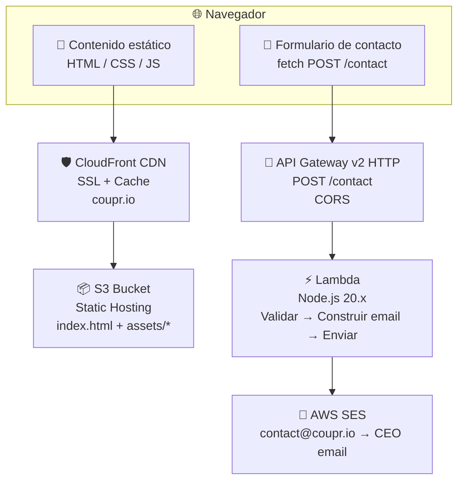
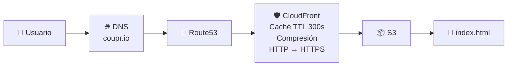
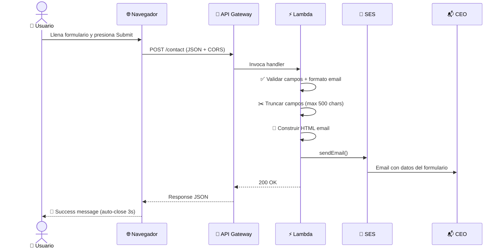

# Arquitectura — Coupr Landing Page

> Generado: 2026-02-12 | Modo: initial_scan | Nivel: exhaustive

## Resumen Ejecutivo

Landing page estática Jamstack desplegada en AWS. El frontend es un archivo HTML único con Tailwind CSS vía CDN. El único componente de backend es una función Lambda serverless que procesa formularios de contacto y envía notificaciones por email vía SES. Toda la infraestructura está definida como código con Terraform.

## Patrón Arquitectónico

**Jamstack Simplificado (Static HTML + Serverless API)**



## Stack Tecnológico Detallado

### Frontend

| Tecnología | Propósito | Integración |
|---|---|---|
| HTML5 | Markup de la landing page | Archivo único `index.html` (~1230 líneas) |
| Tailwind CSS (CDN) | Framework de utilidades CSS | Runtime via `cdn.tailwindcss.com` con config personalizado |
| Swiper.js v11 (CDN) | Carruseles de imágenes y testimonios | 2 instancias: screenshots y testimonials |
| Material Symbols | Iconografía | Google Fonts CDN, variante Outlined |
| Space Grotesk | Tipografía display (headings) | Google Fonts |
| Inter | Tipografía body | Google Fonts |
| Vanilla JavaScript | Interactividad | Modal, form handler, scroll animations, Intersection Observer |

### Configuración de Tailwind (Runtime)

```javascript
tailwind.config = {
    theme: {
        extend: {
            colors: {
                primary: "#E1701A",        // Naranja Coupr
                secondary: "#1A4E5E",      // Azul teal
                "off-white": "#F8F8F8",    // Fondo
                "pure-white": "#FFFFFF",   // Tarjetas
                "slate-subtle": "#E5E7EB", // Bordes
                "text-main": "#1F2937",    // Texto principal
                "text-muted": "#6B7280",   // Texto secundario
            },
            fontFamily: {
                sans: ["Inter", "sans-serif"],
                display: ["Space Grotesk", "sans-serif"],
            }
        }
    }
};
```

### Infraestructura AWS

| Servicio | Recurso | Propósito |
|---|---|---|
| S3 | Bucket privado con OAC | Almacenamiento de archivos estáticos |
| CloudFront | Distribución CDN | SSL, compresión, caché (TTL 300s default) |
| Route53 | A record + CNAME | DNS para coupr.io y www.coupr.io |
| ACM | Certificado SSL | TLSv1.2_2021, SNI |
| API Gateway v2 | HTTP API | Endpoint POST /contact con CORS |
| Lambda | Node.js 20.x, 128MB, 10s | Handler de formulario de contacto |
| SES | Email service | Envío de notificaciones desde contact@coupr.io |
| IAM | Role + policies | Permisos para Lambda → SES, CloudWatch |
| CloudWatch | Log group | Logs de Lambda (14 días retención) |

### Terraform IaC

| Archivo | Recursos | Propósito |
|---|---|---|
| `provider.tf` | Provider AWS, backend local | Configuración base |
| `main.tf` | API Gateway, Stage, Integration, Route | API HTTP para contacto |
| `cloudfront.tf` | S3, CloudFront, Route53, OAC, Bucket Policy | Hosting estático |
| `lambda.tf` | Lambda, IAM Role, Policies, Log Group | Función serverless |
| `variables.tf` | 6 variables | Configuración parametrizada |
| `outputs.tf` | 8 outputs | URLs y IDs de recursos |

## Flujos de Datos

### Flujo 1: Carga de Página



### Flujo 2: Envío de Formulario de Demo



## Seguridad

### Frontend
- No hay datos sensibles expuestos en el HTML
- Formulario usa HTTPS exclusivamente (CloudFront redirect)
- Sin cookies ni almacenamiento local de datos de usuario

### API
- CORS configurado (`Allow-Origin: *`, solo POST + OPTIONS)
- Validación de campos requeridos en Lambda
- Validación de formato email
- Truncado de campos (max 500 chars) para prevenir abuso
- Escape de HTML en el email generado (`escapeHtml()`)

### Infraestructura
- S3 bucket completamente privado (block public access)
- Acceso solo vía CloudFront OAC (Origin Access Control)
- TLS 1.2 mínimo
- IAM role con permisos mínimos (solo SES + CloudWatch)
- Variables sensibles marcadas como `sensitive` en Terraform
- State local (no remoto) — apropiado para proyecto pequeño

## Rendimiento

### Frontend
- **Sin build pipeline**: CDN runtime de Tailwind tiene overhead vs. purged CSS
- **Assets pesados**: SVGs de ilustraciones son grandes (2-7.7MB cada uno)
- **Video hero**: MP4 de 13.6MB (optimizado de 49MB original)
- **Caché CDN**: TTL default 300s, max 86400s (24h)
- **Compresión**: Habilitada en CloudFront

### Backend
- **Lambda cold start**: ~200-500ms (Node.js 20.x, 128MB)
- **Lambda warm**: <100ms
- **Timeout**: 10 segundos
- **Único endpoint**: POST /contact (bajo tráfico esperado)

## Decisiones Arquitectónicas

| Decisión | Justificación |
|---|---|
| HTML estático sin framework SPA | Simplicidad máxima para una landing page. Sin routing, sin estado complejo. SEO friendly. |
| Tailwind via CDN (sin build) | Iteración rápida sin setup de build tools. Trade-off: bundle no optimizado. |
| Lambda para contacto (no SaaS) | Control total, sin dependencia de terceros (como Formspree/Typeform). Costo ~$0. |
| Terraform con state local | Proyecto pequeño, un solo desarrollador. State remoto sería over-engineering. |
| SES para email | Ya existía identidad verificada en la cuenta AWS. Costo prácticamente $0. |
| CloudFront + S3 (no Vercel) | Migración de Vercel a AWS para consolidar stack y reducir dependencias. |
