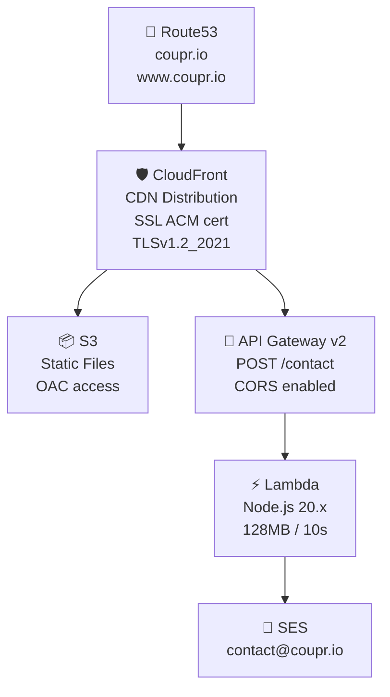

# Guía de Despliegue — Coupr Landing Page

> Generado: 2026-02-12 | Modo: initial_scan | Nivel: exhaustive

## Resumen de Infraestructura

La landing page se despliega en AWS usando Terraform como herramienta de Infrastructure as Code.



## Requisitos Previos

### Herramientas
- **Terraform** >= 1.0
- **AWS CLI** v2 configurado con credenciales de la cuenta dev

### Recursos AWS Pre-existentes
- Identidad SES `contact@coupr.io` verificada
- Zona Route53 `coupr.io` pública
- Certificado ACM en us-east-1 para `coupr.io` / `*.coupr.io`

## Proceso de Despliegue

### 1. Despliegue Inicial de Infraestructura

```bash
cd infra/terraform

# Crear archivo de variables sensibles
cp terraform.tfvars.example terraform.tfvars
# Editar: recipient_email = "email-del-ceo@coupr.io"

# Inicializar providers
terraform init

# Revisar plan de ejecución
terraform plan

# Aplicar (crear todos los recursos)
terraform apply
```

**Recursos creados**:
- S3 bucket (privado, con OAC)
- CloudFront distribution (SSL, caché, compresión)
- Route53 records (A + CNAME)
- API Gateway HTTP + route POST /contact
- Lambda function + IAM role + policies
- CloudWatch log group

### 2. Deploy del Frontend

```bash
# Subir archivos estáticos a S3
aws s3 sync . s3://$(terraform -chdir=infra/terraform output -raw s3_bucket_name) \
  --exclude ".git/*" \
  --exclude "_bmad/*" \
  --exclude "_bmad-output/*" \
  --exclude "infra/*" \
  --exclude "lambdas/*" \
  --exclude "docs/*" \
  --exclude ".claude/*" \
  --exclude ".playwright-mcp/*" \
  --exclude ".DS_Store" \
  --exclude "*.md" \
  --exclude ".gitignore"

# Invalidar caché de CloudFront
aws cloudfront create-invalidation \
  --distribution-id $(terraform -chdir=infra/terraform output -raw cloudfront_distribution_id) \
  --paths "/*"
```

### 3. Actualizar Código de la Lambda

```bash
cd infra/terraform

# Terraform re-empaqueta automáticamente el zip y detecta cambios
terraform apply
# Solo se actualizará la Lambda si index.js cambió (source_code_hash)
```

## Variables de Configuración

### Terraform Variables (`variables.tf`)

| Variable | Tipo | Default | Descripción |
|---|---|---|---|
| `aws_region` | string | `us-east-1` | Región AWS |
| `recipient_email` | string (sensitive) | — | Email del destinatario de demos |
| `sender_email` | string | `contact@coupr.io` | Email remitente de notificaciones |
| `project_name` | string | `coupr-landing` | Prefijo para nombres de recursos |
| `environment` | string | `dev` | Ambiente de despliegue |
| `acm_certificate_arn` | string | (pre-configurado) | ARN del certificado SSL |

### Variables de Entorno Lambda

| Variable | Valor | Descripción |
|---|---|---|
| `RECIPIENT_EMAIL` | Desde terraform.tfvars | Email del CEO/equipo |
| `SENDER_EMAIL` | `contact@coupr.io` | Identidad SES verificada |

## Outputs de Terraform

```bash
terraform output
```

| Output | Descripción | Ejemplo |
|---|---|---|
| `api_endpoint` | Base URL del API Gateway | `https://xxx.execute-api.us-east-1.amazonaws.com` |
| `contact_form_url` | URL completa del endpoint | `https://xxx.execute-api.us-east-1.amazonaws.com/contact` |
| `lambda_function_name` | Nombre de la Lambda | `coupr-landing-contact-form` |
| `lambda_function_arn` | ARN de la Lambda | `arn:aws:lambda:...` |
| `cloudfront_domain` | Dominio de CloudFront | `dxxxxx.cloudfront.net` |
| `cloudfront_distribution_id` | ID de distribución | `EXXXXXXXXX` |
| `s3_bucket_name` | Nombre del bucket S3 | `coupr-landing-static-009160036798` |
| `landing_url` | URL de la landing | `https://dxxxxx.cloudfront.net` |

## Configuración de CloudFront

| Parámetro | Valor | Descripción |
|---|---|---|
| Default TTL | 300s (5 min) | Tiempo de caché por defecto |
| Max TTL | 86400s (24h) | Máximo tiempo de caché |
| Compress | true | Compresión automática |
| Viewer Protocol | redirect-to-https | Fuerza HTTPS |
| SSL Version | TLSv1.2_2021 | Mínimo TLS 1.2 |
| Error 403 | → 200 /index.html | SPA-style fallback |

## CI/CD

**Estado actual**: No hay pipeline de CI/CD automatizado. El despliegue es manual.

**Proceso manual**:
1. Modificar archivos localmente
2. Probar en navegador local
3. Commit y push al repositorio
4. Deploy manual a S3 + invalidación de CloudFront

**Mejoras futuras recomendadas**:
- GitHub Actions para deploy automático en push a `main`
- Terraform Cloud o S3 backend para state remoto
- Staging environment antes de producción

## Monitoreo

### CloudWatch Logs

```bash
# Ver logs recientes de la Lambda
aws logs tail /aws/lambda/coupr-landing-contact-form --follow --since 1h

# Buscar errores
aws logs filter-log-events \
  --log-group-name /aws/lambda/coupr-landing-contact-form \
  --filter-pattern "ERROR"
```

### Verificación de Health

```bash
# Verificar que la landing carga
curl -s -o /dev/null -w "%{http_code}" https://coupr.io
# Esperado: 200

# Verificar que el endpoint de contacto responde
curl -s -o /dev/null -w "%{http_code}" -X OPTIONS \
  https://s04r3s9ik7.execute-api.us-east-1.amazonaws.com/contact
# Esperado: 200
```

## Seguridad del Despliegue

- `terraform.tfvars` **NO** se commitea (contiene email sensible)
- `terraform.tfstate` **NO** se commitea (contiene configuración detallada de AWS)
- S3 bucket es **completamente privado** (block public access)
- Acceso a S3 solo vía CloudFront OAC (Origin Access Control)
- Lambda tiene permisos IAM **mínimos** (solo SES + CloudWatch)
- Variables sensibles marcadas como `sensitive` en Terraform
